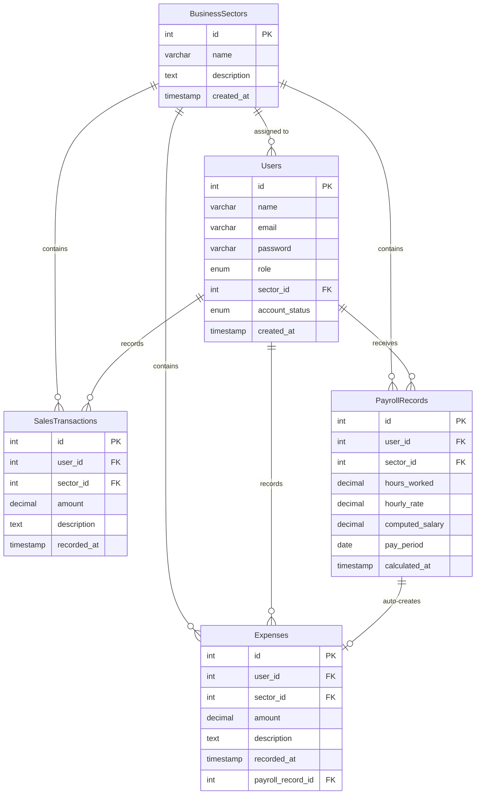

# Database Relationship Diagram (Physical ERD) — DYS Financial Management System (DYS FMS)

## Physical ER Diagram



---

## Relationship Table

| # | Parent | Child | Relationship | Foreign Key | Description |
|---|--------|-------|-------------|-------------|-------------|
| 1 | Business Sectors | Users | One-to-Many | `Users.sector_id` → Business Sectors.id | A sector can have many users assigned. Owner has null sector_id (cross-sector access). |
| 2 | Business Sectors | Sales Transactions | One-to-Many | `Sales Transactions.sector_id` → Business Sectors.id | A sector contains many sales transactions. |
| 3 | Business Sectors | Expenses | One-to-Many | `Expenses.sector_id` → Business Sectors.id | A sector contains many expense records. |
| 4 | Business Sectors | Payroll Records | One-to-Many | `Payroll Records.sector_id` → Business Sectors.id | A sector contains many payroll records. |
| 5 | Users | Sales Transactions | One-to-Many | `Sales Transactions.user_id` → Users.id | A user can record many sales transactions. |
| 6 | Users | Expenses | One-to-Many | `Expenses.user_id` → Users.id | A user can record many expenses (manually or system-generated). |
| 7 | Users | Payroll Records | One-to-Many | `Payroll Records.user_id` → Users.id | An employee can have many payroll records over time. |
| 8 | Payroll Records | Expenses | One-to-One | `Expenses.payroll_record_id` → Payroll Records.id | Each payroll record auto-creates exactly one expense. The FK is nullable — manual expenses have no originating payroll record. |

---

## Primary Key Summary

| Table | Primary Key | Type |
|-------|-------------|------|
| Business Sectors | `id` | INTEGER |
| Users | `id` | INTEGER |
| Sales Transactions | `id` | INTEGER |
| Expenses | `id` | INTEGER |
| Payroll Records | `id` | INTEGER |

All primary keys are auto-incrementing INTEGER columns.

---

## Foreign Key Summary

| FK Column | Source Table | Target Table | Nullable | Description |
|-----------|-------------|-------------|----------|-------------|
| `sector_id` | Users | Business Sectors | YES | Null for Business Owner (cross-sector access); required for Event Managers and Employees |
| `sector_id` | Sales Transactions | Business Sectors | NO | Scopes each sale to the sector active at time of recording |
| `sector_id` | Expenses | Business Sectors | NO | Scopes each expense to the sector active at time of recording |
| `sector_id` | Payroll Records | Business Sectors | NO | Scopes each payroll record to the employee's assigned sector |
| `user_id` | Sales Transactions | Users | NO | Identifies who recorded the sale |
| `user_id` | Expenses | Users | NO | Identifies who recorded the expense (or system user for auto-created) |
| `user_id` | Payroll Records | Users | NO | Identifies the employee for whom payroll was calculated |
| `payroll_record_id` | Expenses | Payroll Records | YES | Set only when expense is auto-created by payroll; null for manual expenses |

**Total foreign keys:** 8
**Nullable FKs:** 2 (`Users.sector_id`, `Expenses.payroll_record_id`)
**Non-nullable FKs:** 6

---

## Referential Integrity Rules

| FK Column | ON UPDATE | ON DELETE | Rationale |
|-----------|-----------|-----------|-----------|
| `Users.sector_id` → Business Sectors.id | CASCADE | SET NULL | If sector ID changes, propagate. If sector is deleted, set to null (Owner is unaffected; EM/Employee deletion handled by application). |
| `Sales Transactions.sector_id` → Business Sectors.id | CASCADE | RESTRICT | If sector ID changes, propagate. Prevent deletion of a sector that has transactions. |
| `Expenses.sector_id` → Business Sectors.id | CASCADE | RESTRICT | If sector ID changes, propagate. Prevent deletion of a sector that has expenses. |
| `Payroll Records.sector_id` → Business Sectors.id | CASCADE | RESTRICT | If sector ID changes, propagate. Prevent deletion of a sector that has payroll records. |
| `Sales Transactions.user_id` → Users.id | CASCADE | RESTRICT | If user ID changes, propagate. Prevent deletion of a user with recorded sales. |
| `Expenses.user_id` → Users.id | CASCADE | RESTRICT | If user ID changes, propagate. Prevent deletion of a user with recorded expenses. |
| `Payroll Records.user_id` → Users.id | CASCADE | RESTRICT | If user ID changes, propagate. Prevent deletion of a user with payroll records. |
| `Expenses.payroll_record_id` → Payroll Records.id | CASCADE | RESTRICT | If payroll record ID changes, propagate. Prevent deletion of a payroll record that has a linked expense (payroll records are permanent). |

### Cascade Behavior Notes

- **CASCADE** on UPDATE: chosen for all FKs since primary keys are auto-increment integers and should never change in practice; the rule exists for referential integrity completeness.
- **RESTRICT** on DELETE for transactional tables: sales, expenses, and payroll records are permanent records that should not be deleted while dependent records exist.
- **SET NULL** on `Users.sector_id`: the Business Owner has null sector_id intentionally; if a sector is deleted, affected users would need reassignment by the Business Owner via the application layer.
- **RESTRICT** on `payroll_record_id`: payroll records are stored permanently per business rule; they cannot be deleted once created.

---

## Data Flow Summary

### Authentication & Access Flow
```
User provides credentials
        ↓
System validates email/password against Users table
        ↓
System checks account_status (Active = allow, Inactive = deny)
        ↓
System determines role and default sector
        ↓
User is redirected to role-based Dashboard
```

### Sales Recording Flow
```
Business Owner or Event Manager opens Sales screen
        ↓
Enters amount and description
        ↓
System validates input
        ↓
System inserts a Sales Transactions record
    ├── user_id ← authenticated user
    ├── sector_id ← current sector context
    └── amount, description, recorded_at
        ↓
Dashboard and Reports reflect updated data
```

### Expense Recording Flow (Manual)
```
Business Owner or Event Manager opens Expenses screen
        ↓
Enters amount and description
        ↓
System validates input
        ↓
System inserts an Expenses record
    ├── user_id ← authenticated user
    ├── sector_id ← current sector context
    ├── amount, description, recorded_at
    └── payroll_record_id ← NULL (manual entry)
        ↓
Dashboard and Reports reflect updated data
```

### Payroll Processing Flow
```
Business Owner opens Payroll screen
        ↓
Selects an Event Manager or Employee/Event Staff
        ↓
Enters hours_worked and hourly_rate
        ↓
System computes: computed_salary = hours_worked × hourly_rate
        ↓
System creates a Payroll Records record
    ├── user_id ← selected employee
    ├── sector_id ← employee's assigned sector
    ├── hours_worked, hourly_rate, computed_salary
    ├── pay_period, calculated_at
    └── stored permanently

        ↓  (automatic, same transaction)

System creates an Expenses record (auto-created)
    ├── user_id ← authenticated Business Owner
    ├── sector_id ← same as payroll record
    ├── amount ← computed_salary
    ├── description ← e.g. "Payroll — [employee name] — [pay period]"
    ├── recorded_at ← same as calculated_at
    └── payroll_record_id ← FK to the originating Payroll Records.id
```

### Business Sector Switching Flow
```
Business Owner activates Sector Switcher
        ↓
Selects target sector from Business Sectors
        ↓
System updates session context
        ↓
All subsequent queries filter by the selected sector_id
```

### User Account Management Flow
```
Business Owner opens Manage Users screen
        ↓
Creates a new Users record
    ├── name, email, password (temporary, hashed)
    ├── role (Event Manager or Employee/Staff)
    ├── sector_id ← assigned sector
    ├── account_status ← Active
    └── created_at
        ↓
System displays temporary credentials
        ↓
Business Owner provides credentials to the user
        ↓
User logs in
```

---

## Data Lineage Diagram

```
Business Sectors (parent)
    │
    ├──→ Users (child via sector_id)
    │       │
    │       ├──→ Sales Transactions (child via user_id)
    │       ├──→ Expenses (child via user_id)
    │       └──→ Payroll Records (child via user_id)
    │               │
    │               └──→ Expenses (child via payroll_record_id)
    │
    ├──→ Sales Transactions (child via sector_id)
    ├──→ Expenses (child via sector_id)
    └──→ Payroll Records (child via sector_id)
```

---

## Consistency Check

| Source | Status |
|--------|--------|
| Concept Paper | ✓ |
| ER Diagram | ✓ |
| Database Schema | ✓ |
| Data Dictionary | ✓ |
| User Account Management | ✓ |
| Payroll Clarification | ✓ |
| User Flow | ✓ |
| System Flowchart | ✓ |
| Wireframes | ✓ |
| System Components | ✓ |
| Project Memory | ✓ |

**Issues Found:** None

---

## Document Statistics

| Metric | Value |
|--------|-------|
| Tables | 5 |
| Columns | 33 |
| Primary Keys | 5 |
| Foreign Keys | 8 |
| Relationships | 8 |
| Nullable FKs | 2 |
| Database Normalization | Third Normal Form (3NF) |

---

## Final Status

| Attribute | Value |
|-----------|-------|
| Document | Database Relationship Diagram (Physical ERD) |
| Version | 1.1 |
| Status | Approved Blueprint — Frozen — Ready for Development |
