# Navigation Map — DYS Financial Management System (DYS FMS)

**Version:** 1.1
**Status:** Draft (Pending Audit)
**Project:** DYS Financial Management System (DYS FMS)

---

## Document Purpose

This document defines every screen, navigation path, and role-based routing rule for the DYS FMS Flutter mobile application. It serves as the master navigation reference for development.

---

## Screen Inventory

The system consists of exactly eight screens. No additional screens exist.

| # | Screen | Hi-Fi File | Role Access | Type |
|---|--------|------------|-------------|------|
| 1 | Login | `login.html` | All roles (unauthenticated) | Full-screen, no bottom nav |
| 2 | Dashboard | `dashboard.html` | All roles (role-specific variants) | Landing screen, bottom nav hub |
| 3 | Sales | `sales.html` | Business Owner, Event Manager | Data entry + list, back button |
| 4 | Expenses | `expenses.html` | Business Owner, Event Manager | Data entry + list, back button |
| 5 | Payroll | `payroll.html` | All roles (role-specific variants) | Data entry (Owner) + list, back button |
| 6 | Reports | `reports.html` | Business Owner, Event Manager | Data view, back button |
| 7 | Sector Switcher | `sector-switcher.html` | Business Owner only | Selection screen, back button |
| 8 | User Account Management | `users.html` | Business Owner only | Management screen, bottom nav |

---

## Mermaid Navigation Diagram

```mermaid
graph TB
    subgraph Unauthenticated
        Login[Login Screen]
    end

    subgraph "Business Owner Navigation"
        BO_Dashboard[Dashboard<br/>Default: DYS Events]
        BO_Sales[Sales]
        BO_Expenses[Expenses]
        BO_Payroll[Payroll<br/>Calculate + View All]
        BO_Reports[Reports<br/>Analytics + Cross-sector]
        BO_SectorSwitcher[Sector Switcher]
        BO_Users[User Account Management]
    end

    subgraph "Event Manager Navigation"
        EM_Dashboard[Dashboard<br/>Default: Assigned Sector]
        EM_Sales[Sales<br/>Assigned Sector Only]
        EM_Expenses[Expenses<br/>Assigned Sector Only]
        EM_Payroll[Payroll<br/>View Own Only]
        EM_Reports[Reports<br/>Assigned Sector Only]
    end

    subgraph "Employee / Event Staff Navigation"
        EE_Dashboard[Dashboard<br/>Default: Assigned Sector]
        EE_Payroll[Payroll<br/>View Own Only]
        EE_Reports[Reports<br/>= Own Payroll View]
    end

    %% All roles start at Login
    Login --> BO_Dashboard
    Login --> EM_Dashboard
    Login --> EE_Dashboard

    %% Business Owner navigation
    BO_Dashboard -->|"Quick Action / Bottom Nav"| BO_Sales
    BO_Dashboard -->|"Quick Action / Bottom Nav"| BO_Expenses
    BO_Dashboard -->|"Quick Action / Bottom Nav"| BO_Payroll
    BO_Dashboard -->|"Quick Action / Bottom Nav"| BO_Reports
    BO_Dashboard -->|"Sector Chip"| BO_SectorSwitcher
    BO_Dashboard -->|"Quick Action / Bottom Nav"| BO_Users

    BO_Sales -->|"Back / Bottom Nav"| BO_Dashboard
    BO_Expenses -->|"Back / Bottom Nav"| BO_Dashboard
    BO_Payroll -->|"Back / Bottom Nav"| BO_Dashboard
    BO_Reports -->|"Back / Bottom Nav"| BO_Dashboard
    BO_SectorSwitcher -->|"Back / Selection"| BO_Dashboard
    BO_Users -->|"Bottom Nav"| BO_Dashboard

    BO_Dashboard -->|"Logout"| Login

    %% Event Manager navigation
    EM_Dashboard -->|"Quick Action / Bottom Nav"| EM_Sales
    EM_Dashboard -->|"Quick Action / Bottom Nav"| EM_Expenses
    EM_Dashboard -->|"Quick Action / Bottom Nav"| EM_Payroll
    EM_Dashboard -->|"Quick Action / Bottom Nav"| EM_Reports

    EM_Sales -->|"Back / Bottom Nav"| EM_Dashboard
    EM_Expenses -->|"Back / Bottom Nav"| EM_Dashboard
    EM_Payroll -->|"Back / Bottom Nav"| EM_Dashboard
    EM_Reports -->|"Back / Bottom Nav"| EM_Dashboard

    EM_Dashboard -->|"Logout"| Login

    %% Employee / Event Staff navigation
    EE_Dashboard -->|"Quick Action / Bottom Nav"| EE_Payroll
    EE_Dashboard -->|"Bottom Nav"| EE_Reports

    EE_Payroll -->|"Back / Bottom Nav"| EE_Dashboard
    EE_Reports -->|"Back / Bottom Nav"| EE_Dashboard

    EE_Dashboard -->|"Logout"| Login

    %% Style definitions
    classDef owner fill:#e3f2fd,stroke:#1565c0,stroke-width:2px
    classDef em fill:#f3e5f5,stroke:#7b1fa2,stroke-width:2px
    classDef employee fill:#e8f5e9,stroke:#2e7d32,stroke-width:2px
    classDef auth fill:#fff3e0,stroke:#e65100,stroke-width:2px

    class BO_Dashboard,BO_Sales,BO_Expenses,BO_Payroll,BO_Reports,BO_SectorSwitcher,BO_Users owner
    class EM_Dashboard,EM_Sales,EM_Expenses,EM_Payroll,EM_Reports em
    class EE_Dashboard,EE_Payroll,EE_Reports employee
    class Login auth
```



---

## Navigation Matrix

### Screen Access by Role

| Screen | Business Owner | Event Manager | Employee / Event Staff |
|--------|:--------------:|:-------------:|:----------------------:|
| Login | ✓ | ✓ | ✓ |
| Dashboard | ✓ | ✓ | ✓ |
| Sales | ✓ | ✓ (assigned sector only) | — |
| Expenses | ✓ | ✓ (assigned sector only) | — |
| Payroll | ✓ (calculate + view all) | ✓ (view own only) | ✓ (view own only) |
| Reports | ✓ (analytics, cross-sector, per-sector) | ✓ (assigned sector only) | ✓ (own payroll only) |
| Sector Switcher | ✓ | — | — |
| User Account Management | ✓ | — | — |

### Bottom Navigation Bar by Role

| Tab | Business Owner | Event Manager | Employee / Event Staff |
|-----|:--------------:|:-------------:|:----------------------:|
| Dashboard | ✓ (default active) | ✓ (default active) | ✓ (default active) |
| Sales | ✓ | ✓ | — |
| Expenses | ✓ | ✓ | — |
| Payroll | ✓ | ✓ | ✓ |
| Users | ✓ | — | — |
| Reports | ✓ | ✓ | ✓ |

### Quick Action Buttons on Dashboard by Role

| Action | Business Owner | Event Manager | Employee / Event Staff |
|--------|:--------------:|:-------------:|:----------------------:|
| Record Sale | ✓ | ✓ | — |
| Record Expense | ✓ | ✓ | — |
| View Reports | ✓ | ✓ | — |
| View Payroll | ✓ | ✓ | ✓ |
| Manage Users | ✓ | — | — |
| Switch Sector | ✓ (sector chip) | — | — |

---

## Default Landing Pages

| Role | Initial Screen | Default Sector | Sector Source |
|------|:-------------:|:--------------:|:-------------:|
| Business Owner | Dashboard | DYS Event Management | System default (sector_id = 1, name = "DYS Events") |
| Event Manager | Dashboard | Assigned business sector | From Users.sector_id |
| Employee / Event Staff | Dashboard | Assigned business sector | From Users.sector_id |

---

## Navigation Rules

### Rule 1: Authentication Gate
- All screens (except Login) require authentication
- Unauthenticated users see only the Login screen
- Login validates credentials, checks account status, determines role, and redirects to the role-appropriate Dashboard
- Successful login sets the initial sector context (Owner: DYS Event Management; EM/Employee: assigned sector)
- Login screen has no bottom navigation bar

### Rule 2: Logout
- Logout is accessible from any authenticated screen (via profile avatar menu — no dedicated screen)
- Logout calls POST /api/logout and returns to the Login screen
- There is no confirmation dialog defined in wireframes
- After logout, all stored tokens and sector state are cleared client-side

### Rule 3: Dashboard is the Central Hub
- Every authenticated user lands on the Dashboard after login
- All screens (except Login) navigate through the Dashboard
- All operational screens (Sales, Expenses, Payroll, Reports) have a back button that returns to Dashboard
- Dashboard adapts its content and navigation based on the user's role

### Rule 4: Bottom Navigation
- The bottom navigation bar is visible on: Dashboard, Sales, Expenses, Payroll, Users (Owner), Reports
- The bottom navigation bar is NOT visible on: Login, Sector Switcher
- Tapping a bottom nav item navigates to the corresponding screen
- The active screen's bottom nav item is highlighted
- The bottom nav items are role-specific (see Navigation Matrix above)

### Rule 5: Business Owner Navigation
- Full bottom navigation: Dashboard, Sales, Expenses, Payroll, Users, Reports
- Sector chip on Dashboard navigates to Sector Switcher
- Quick actions on Dashboard: Record Sale, Record Expense, View Reports, View Payroll, Manage Users
- Payroll screen shows employee selector, Hours/Rate inputs, calculation panel, and payroll history for all employees
- Reports screen provides analytics dashboard, cross-sector reports, and per-sector reports
- User Account Management screen is accessible via bottom nav and quick action

### Rule 6: Event Manager Navigation
- Bottom navigation: Dashboard, Sales, Expenses, Payroll, Reports (no Users, no Sector Switcher)
- Sector chip on Dashboard is read-only (no navigation to Sector Switcher)
- Quick actions on Dashboard: Record Sale, Record Expense, View Reports, View Payroll
- Manage Users and Sector Switcher are NOT available on the Dashboard
- Sales and Expenses screens show data scoped to the assigned sector only
- Payroll screen shows own payroll history only (no employee selector, no calculation panel)
- Reports screen shows assigned sector reports only

### Rule 7: Employee / Event Staff Navigation
- Bottom navigation: Dashboard, Payroll, Reports
- Record Sale is NOT available
- Record Expense is NOT available
- Sector Switcher is NOT available
- Manage Users is NOT available
- Payroll screen shows own payroll history only (no employee selector, no calculation panel)
- The Reports bottom nav item displays the same own-payroll data as the Payroll screen (Employee has no separate Reports screen — payroll view is the only reporting access)

### Rule 8: Sector Switcher (Owner Only)
- Accessible via the sector chip on the Dashboard
- NOT accessible via bottom navigation (no nav item)
- After selecting a new sector, the system returns to the Dashboard with the new sector context active
- Only Business Owner can access this screen
- Event Managers and Employees have no access

### Rule 9: User Account Management (Owner Only)
- Accessible via bottom navigation (Users tab) and quick action on Dashboard (Manage Users)
- Contains user list table and Add/Edit form
- Only Business Owner can access this screen
- Event Managers and Employees cannot access this screen

### Rule 10: No Circular or Cross-Branch Navigation
- There is no direct navigation from Sales to Expenses (user must go through Dashboard)
- There is no direct navigation from Payroll to Reports (user must go through Dashboard)
- All inter-screen navigation passes through the Dashboard (except bottom nav tabs)

### Rule 11: No Register, Sign Up, or Forgot Password
- There is no Register screen
- There is no Sign Up screen
- There is no Forgot Password screen or workflow
- Account creation happens exclusively through the User Account Management screen (Business Owner only)

---

## Back Navigation

All operational screens (Sales, Expenses, Payroll, Reports, Sector Switcher) include a back button in the app bar that returns to the Dashboard.

| Screen | Back Button Target | Mechanism |
|--------|:------------------:|:---------:|
| Sales | Dashboard | Back arrow in app bar |
| Expenses | Dashboard | Back arrow in app bar |
| Payroll | Dashboard | Back arrow in app bar |
| Reports | Dashboard | Back arrow in app bar |
| Sector Switcher | Dashboard | Back arrow in app bar |
| User Account Management | Dashboard (or previous bottom nav tab) | Bottom nav tab switch |

**Back navigation behavior:**
- Tapping the back button always returns to the Dashboard
- The Dashboard retains the sector context that was active when the user left it
- No confirmation dialogs are displayed on back navigation
- There is no Android hardware back button behavior documented in wireframes — Flutter's default back gesture returns to the same destination

---

## Screen Relationships

### Dashboard ↔ Sales
```
Dashboard → [Quick Action: Record Sale / Bottom Nav: Sales] → Sales
Sales → [Back Button / Bottom Nav: Dashboard] → Dashboard
```

### Dashboard ↔ Expenses
```
Dashboard → [Quick Action: Record Expense / Bottom Nav: Expenses] → Expenses
Expenses → [Back Button / Bottom Nav: Dashboard] → Dashboard
```

### Dashboard ↔ Payroll
```
Dashboard → [Quick Action: View Payroll / Bottom Nav: Payroll] → Payroll
Payroll → [Back Button / Bottom Nav: Dashboard] → Dashboard
```

### Dashboard ↔ Reports
```
Dashboard → [Quick Action: View Reports / Bottom Nav: Reports] → Reports
Reports → [Back Button / Bottom Nav: Dashboard] → Dashboard
```

### Dashboard ↔ Sector Switcher (Owner Only)
```
Dashboard → [Sector Chip] → Sector Switcher
Sector Switcher → [Back Button / Sector Selection] → Dashboard
```

### Dashboard ↔ User Account Management (Owner Only)
```
Dashboard → [Quick Action: Manage Users / Bottom Nav: Users] → Users
Users → [Bottom Nav: Dashboard tab] → Dashboard
```

---

## Role Navigation Summary

### Business Owner

| Step | Screen | Entry Point |
|:----:|--------|:-----------:|
| 1 | Login | App launch |
| 2 | Dashboard (DYS Events default) | Successful login |
| 3.a | Sales | Quick action or bottom nav |
| 3.b | Expenses | Quick action or bottom nav |
| 3.c | Payroll | Quick action or bottom nav |
| 3.d | Reports | Quick action or bottom nav |
| 3.e | Sector Switcher | Sector chip on Dashboard |
| 3.f | User Account Management | Quick action or bottom nav |
| 4 | Any screen → Dashboard | Back button or bottom nav tab |
| 5 | Login | Logout |

**Bottom nav:** Dashboard, Sales, Expenses, Payroll, Users, Reports

### Event Manager

| Step | Screen | Entry Point |
|:----:|--------|:-----------:|
| 1 | Login | App launch |
| 2 | Dashboard (assigned sector default) | Successful login |
| 3.a | Sales (assigned sector only) | Quick action or bottom nav |
| 3.b | Expenses (assigned sector only) | Quick action or bottom nav |
| 3.c | Payroll (own only) | Quick action or bottom nav |
| 3.d | Reports (assigned sector only) | Quick action or bottom nav |
| 4 | Any screen → Dashboard | Back button or bottom nav tab |
| 5 | Login | Logout |

**Bottom nav:** Dashboard, Sales, Expenses, Payroll, Reports

### Employee / Event Staff

| Step | Screen | Entry Point |
|:----:|--------|:-----------:|
| 1 | Login | App launch |
| 2 | Dashboard (assigned sector default) | Successful login |
| 3.a | Payroll (own only) | Quick action or bottom nav |
| 3.b | Reports (= own payroll view) | Bottom nav |
| 4 | Any screen → Dashboard | Back button or bottom nav tab |
| 5 | Login | Logout |

**Bottom nav:** Dashboard, Payroll, Reports

---

## Screen Transition Rules

| Transition | Roles | Navigation Mechanism | Sector Context |
|------------|:-----:|:--------------------:|:--------------:|
| Login → Dashboard | All | Post-authentication redirect | Set by login response |
| Dashboard → Sales | Owner, EM | Bottom nav tab / quick action | Preserved from Dashboard |
| Dashboard → Expenses | Owner, EM | Bottom nav tab / quick action | Preserved from Dashboard |
| Dashboard → Payroll | All | Bottom nav tab / quick action | Preserved from Dashboard |
| Dashboard → Reports | Owner, EM | Bottom nav tab / quick action | Preserved from Dashboard |
| Dashboard → Sector Switcher | Owner | Sector chip tap | Preserved (changed on selection) |
| Dashboard → Users | Owner | Bottom nav tab / quick action | Not applicable |
| Sales → Dashboard | Owner, EM | Back button / bottom nav tab | Preserved |
| Expenses → Dashboard | Owner, EM | Back button / bottom nav tab | Preserved |
| Payroll → Dashboard | All | Back button / bottom nav tab | Preserved |
| Reports → Dashboard | Owner, EM | Back button / bottom nav tab | Preserved |
| Sector Switcher → Dashboard | Owner | Back button / sector selection | Updated to selected sector |
| Users → Dashboard | Owner | Bottom nav tab | Not applicable (restored) |
| Any screen → Login | All | Logout action | Cleared |

---

## Consistency Audit

| Source | Status |
|--------|--------|
| Functional Requirements Specification (FRS) | ✓ |
| Concept Paper | ✓ |
| Client Clarifications | ✓ |
| System Architecture | ✓ |
| System Flowchart | ✓ |
| User Flow | ✓ |
| Use Case | ✓ |
| Use Case Diagram (Visual) | ✓ |
| Wireframes (Low-Fi) | ✓ |
| Wireframes (Hi-Fi) | ✓ |
| API Specification | ✓ |
| ER Diagram | ✓ |
| Database Schema | ✓ |
| Data Dictionary | ✓ |
| Physical ERD | ✓ |
| System Components | ✓ |
| Project Memory | ✓ |
| AI Instructions | ✓ |
| CHANGELOG | ✓ |
| VERSION | ✓ |

**Issues Found:** None

**Verification summary:**
- Exactly 8 screens documented (Login, Dashboard, Sales, Expenses, Payroll, Reports, Sector Switcher, User Account Management)
- No Register, Sign Up, Forgot Password, or other invented screens
- No Admin or Super Admin roles or screen access
- All navigation paths match the Hi-Fi wireframe links and button targets
- Bottom navigation bars match the FRS per-role specifications
- Quick action buttons match the FRS per-role specifications
- Sector Switcher accessible only to Business Owner (via sector chip, not bottom nav)
- User Account Management accessible only to Business Owner (via bottom nav Users tab and quick action)
- All back buttons in wireframes point to dashboard.html
- Employee bottom nav includes Reports (shows own payroll data — Employee's only reporting access)
- Login screen has no bottom navigation bar
- No confirmation dialogs on back navigation (as specified)
- API endpoints align with documented screens

---

## Final Status

| Attribute | Value |
|-----------|-------|
| Document | Navigation Map / Screen Map |
| Version | 1.1 |
| Status | Draft — Pending Audit |
| Repository | Synchronized |
| Unsupported Screens | None introduced |
| Ready for Review | Yes |
