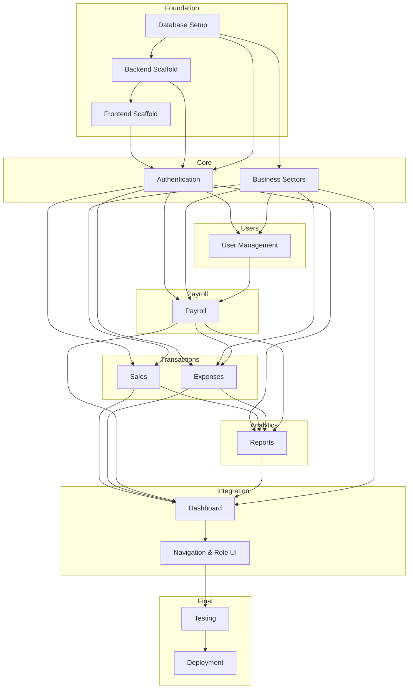

# Development Roadmap — DYS Financial Management System (DYS FMS)

**Version:** 1.1
**Status:** APPROVED — FROZEN — READY FOR DEVELOPMENT
**Project:** DYS Financial Management System (DYS FMS)

---

## Purpose

This document defines the official development sequence for the DYS Financial Management System. It organizes implementation into ten phases based on module dependencies, data flow, and layer architecture. Every phase is derived exclusively from the approved blueprint. No features, modules, or technologies outside the approved scope are introduced.

## Development Philosophy

- **Layer-by-layer:** Each module is built from database → API → UI, in that order
- **Dependency-first:** No module is started until its dependencies are complete
- **Auth-gated:** Every protected endpoint and screen requires authentication first
- **Database-seeded early:** Business Sectors are seeded before any dependent module
- **Role-aware from Phase 1:** Authentication must return role and default sector for RBAC
- **Dashboard last:** The Dashboard is a composite view — it integrates data from all other modules
- **No parallel modules:** Each phase builds on the previous one (except where noted)

## Module Dependency Order



## Module Dependency Matrix

| Module | Depends On |
|--------|:----------:|
| Database Setup | — |
| Backend Scaffold | Database Setup |
| Frontend Scaffold | — |
| Authentication | Database Setup, Backend Scaffold, Frontend Scaffold |
| Business Sectors | Database Setup, Backend Scaffold |
| User Management | Authentication, Business Sectors |
| Sales | Authentication, Business Sectors |
| Expenses | Authentication, Business Sectors |
| Payroll | Authentication, User Management, Business Sectors |
| Reports | Sales, Expenses, Payroll |
| Dashboard | Sales, Expenses, Payroll, Reports, Business Sectors, Authentication |
| Navigation & Role UI | Authentication, Dashboard |
| Testing | All modules |
| Deployment | Testing |

## Build Order Summary

| Order | Module | Phase |
|:-----:|--------|:-----:|
| 1 | Database Setup + Seeding | Phase 1 |
| 2 | Backend Scaffold (Laravel project, models, migrations) | Phase 1 |
| 3 | Frontend Scaffold (Flutter project, HTTP client, routing shell) | Phase 1 |
| 4 | Authentication API + Login Screen | Phase 1 |
| 5 | Business Sectors API + Sector data | Phase 1 (alongside Auth) |
| 6 | User Account Management API + Users Screen | Phase 2 |
| 7 | Sales API + Sales Screen | Phase 3 |
| 8 | Expenses API + Expenses Screen | Phase 4 |
| 9 | Payroll API + Payroll Screen | Phase 5 |
| 10 | Reports API + Reports Screen | Phase 6 |
| 11 | Business Sector Switching screen (UI) | Phase 7 |
| 12 | Dashboard integration, role-based navigation wiring | Phase 8 |
| 13 | Integration testing, end-to-end flows | Phase 9 |
| 14 | Build configuration, environment setup | Phase 10 |

## Critical Path

The critical path through the dependency graph is:

```
Database Setup → Backend Scaffold Authentication → User Management → Payroll → Reports → Dashboard Final Integration → Testing → Deployment
```

Sales and Expenses can be developed in parallel with each other (both depend on Auth + Sectors, neither depends on the other). Payroll depends on User Management (employees must exist). Reports depends on all transaction data. Dashboard depends on all modules.

---

## Phase 1 — Authentication & Core Setup

### Objective

Establish the project foundation: database schema, Laravel project, Flutter project, and the authentication system that gates all subsequent modules.

### Components Involved

- Database migrations for the approved database schema
- Seed initial Business Sectors and Business Owner account
- Laravel project with Sanctum authentication
- Flutter project with HTTP client, routing shell, and theme
- Login screen (Screen 1)
- Logout behavior
- Token management

### Related API Endpoints

| Method | Route | Purpose |
|--------|-------|---------|
| POST | /api/login | Authenticate and receive token |
| POST | /api/logout | Revoke token |

### Related Database Tables

- Users (all columns — `id`, `name`, `email`, `password`, `role`, `sector_id`, `account_status`, `created_at`)
- Business Sectors (seed with 4 approved sectors: DYS Events, B&DYS, Flavors by DYS, SnapDYS Memories)
- Personal Access Tokens (managed by Sanctum)

### Related Screens

- Login Screen (Screen 1)

### Related Validation Rules

- Email: required, valid format, must exist in Users table
- Password: required, must match hashed password
- account_status: must be Active
- Inactive account: generic error message (no status disclosure)

### Dependencies

None. This is the foundation phase.

### Expected Deliverables

| Deliverable | Layer |
|-------------|:-----:|
| Database migrations for all 5 tables | Database |
| Business Sectors seed data (4 sectors) | Database |
| Business Owner seed account | Database |
| Laravel project with Sanctum configured | Backend |
| User model with role ENUM, account_status ENUM | Backend |
| Login endpoint (POST /api/login) | Backend |
| Logout endpoint (POST /api/logout) | Backend |
| Auth middleware protecting all non-login routes | Backend |
| Flutter project with Material theme and HTTP client | UI |
| Login screen with email/password fields | UI |
| Token storage and Bearer header injection | UI |
| Role-based route guard (scaffold for future screens) | UI |

---

## Phase 2 — User Account Management

### Objective

Implement the Business Owner's ability to create, read, update, and deactivate/reactivate user accounts. This module is Business Owner only.

### Components Involved

- User Account Management service (Backend)
- User list + Add/Edit form (Screen 8)
- Generate Temporary Password logic
- Activate/Deactivate workflow

### Related API Endpoints

| Method | Route | Purpose |
|--------|-------|---------|
| GET | /api/users | List all users |
| POST | /api/users | Create user account |
| GET | /api/users/{id} | Get single user |
| PUT | /api/users/{id} | Update user account |
| PATCH | /api/users/{id}/status | Activate/deactivate user |

### Related Database Tables

- Users (all columns)
- Business Sectors (for sector_id FK validation)

### Related Screens

- User Account Management Screen (Screen 8)
- Dashboard (Screen 2) — "Manage Users" quick action and "Users" bottom nav tab (Owner only)

### Related Validation Rules

- Name: required, 1–255 characters
- Email: required, valid format, unique
- Role: required; must be Event Manager or Employee/Staff (Business Owner rejected)
- Sector: required; must reference existing Business Sectors.id
- Password: auto-generated, minimum complexity (8+ chars, mixed case, numbers, special)
- account_status: must be Active or Inactive
- Owner's own account cannot be deactivated

### Dependencies

- Phase 1 (Authentication + Core Setup) must be complete
- Business Sectors table must be seeded with 4 sectors

### Expected Deliverables

| Deliverable | Layer |
|-------------|:-----:|
| User CRUD controller + service | Backend |
| Request validation for create/update/status | Backend |
| Temporary password generation logic | Backend |
| Role authorization gate (Owner only) | Backend |
| 5 user management API endpoints | Backend |
| Users screen with user list table | UI |
| Add User button and inline form | UI |
| Edit User (populate form from selected row) | UI |
| Generate Temporary Password button | UI |
| Save Account / Deactivate button row | UI |
| Role/sector dropdowns | UI |
| Account status display (Active/Inactive) | UI |

---

## Phase 3 — Sales

### Objective

Implement sales transaction recording and listing. Available to Business Owner and Event Manager.

### Components Involved

- Sales Management service (Backend)
- Sales Recording screen (Screen 3)
- Recent transactions list table
- Dashboard summary card integration (deferred to Phase 8)

### Related API Endpoints

| Method | Route | Purpose |
|--------|-------|---------|
| GET | /api/sales | List sales transactions (sector-scoped) |
| POST | /api/sales | Record a sale |

### Related Database Tables

- Sales Transactions
- Users (for user_id FK)
- Business Sectors (for sector_id FK)

### Related Screens

- Sales Screen (Screen 3)
- Dashboard (Screen 2) — "Record Sale" quick action and "Sales" bottom nav tab

### Related Validation Rules

- Amount: required, positive (> 0)
- Description: optional, free text
- sector_id: required for Owner; overridden for Event Manager
- Role: Owner or Event Manager only
- Sector scope: Event Manager restricted to assigned sector

### Dependencies

- Phase 1 (Authentication) must be complete
- Business Sectors table must be seeded

### Expected Deliverables

| Deliverable | Layer |
|-------------|:-----:|
| Sales Transactions migration | Database |
| Sales controller + service | Backend |
| Request validation for create/list | Backend |
| Sales sector scoping logic | Backend |
| Sales API endpoints (GET, POST) | Backend |
| Sales screen with amount/description form | UI |
| Recent sales transactions table | UI |
| Save Sale Record button | UI |
| Sector selector (Owner: dropdown; EM: pre-filled) | UI |

---

## Phase 4 — Expenses

### Objective

Implement expense recording and listing. Supports manual entry (Owner, Event Manager) and system-generated entries from payroll (deferred linkage until Phase 5).

### Components Involved

- Expense Management service (Backend)
- Expense Recording screen (Screen 4)
- Recent expenses list table

### Related API Endpoints

| Method | Route | Purpose |
|--------|-------|---------|
| GET | /api/expenses | List expense records (sector-scoped) |
| POST | /api/expenses | Record a manual expense |

### Related Database Tables

- Expenses
- Users (for user_id FK)
- Business Sectors (for sector_id FK)
- Payroll Records (for payroll_record_id FK — nullable, used in Phase 5)

### Related Screens

- Expenses Screen (Screen 4)
- Dashboard (Screen 2) — "Record Expense" quick action and "Expenses" bottom nav tab

### Related Validation Rules

- Amount: required, positive (> 0)
- Description: optional, free text
- sector_id: required for Owner; overridden for Event Manager
- Role: Owner or Event Manager only
- Sector scope: Event Manager restricted to assigned sector

### Dependencies

- Phase 1 (Authentication) must be complete
- Business Sectors table must be seeded

### Expected Deliverables

| Deliverable | Layer |
|-------------|:-----:|
| Expenses migration | Database |
| Expense controller + service | Backend |
| Request validation for create/list | Backend |
| Expense sector scoping logic | Backend |
| Expense API endpoints (GET, POST) | Backend |
| Expenses screen with amount/description form | UI |
| Recent expenses table | UI |
| Save Expense Record button | UI |

---

## Phase 5 — Payroll

### Objective

Implement payroll calculation (Owner only) and payroll history viewing (role-filtered). Includes the system action that auto-creates an Expense record when payroll is saved.

### Components Involved

- Payroll Calculator service (Backend)
- Payroll screen (Screen 5)
- Employee selector, Hours/Rate inputs, Calculation panel
- Payroll History table
- Auto-create Expense (system action in same transaction)

### Related API Endpoints

| Method | Route | Purpose |
|--------|-------|---------|
| GET | /api/payroll | List payroll records (role-filtered) |
| POST | /api/payroll | Calculate and save payroll |

### Related Database Tables

- Payroll Records (hours_worked, hourly_rate, computed_salary, pay_period)
- Users (for employee selection and FK)
- Business Sectors (for sector_id FK)
- Expenses (auto-created record with payroll_record_id FK)

### Related Screens

- Payroll Screen (Screen 5)
- Dashboard (Screen 2) — "View Payroll" quick action and "Payroll" bottom nav tab

### Related Validation Rules

- user_id: required, must exist, role must be Event Manager or Employee/Staff (not Business Owner)
- hours_worked: required, positive, max 99999999.99
- hourly_rate: required, positive, max 99999999.99
- pay_period: required, valid date
- computed_salary: server-derived (hours_worked × hourly_rate)
- Role: Owner only for calculation
- View scope: Owner sees all; EM/Employee see own only

### Dependencies

- Phase 1 (Authentication) must be complete
- Phase 2 (User Management) — employees must exist to select for payroll
- Business Sectors must be seeded
- Phase 4 (Expenses) — Expense table must exist and Expense creation logic must support the auto-creation pathway via payroll_record_id

### Expected Deliverables

| Deliverable | Layer |
|-------------|:-----:|
| Payroll Records migration | Database |
| Payroll controller + service | Backend |
| computed_salary server-side calculation | Backend |
| Auto-create Expense record in same transaction | Backend |
| Payroll role-filtered query logic | Backend |
| Request validation for payroll calculation | Backend |
| Payroll API endpoints (GET, POST) | Backend |
| Payroll screen (Owner variant: employee selector, Hours/Rate, Calculate & Save) | UI |
| Payroll screen (EM/Employee variant: history only, no calculation) | UI |
| Calculation panel display | UI |
| Payroll history table | UI |

---

## Phase 6 — Reports

### Objective

Implement financial report generation with role-specific scoping. The Reports API aggregates data from Sales, Expenses, and Payroll.

### Components Involved

- Reports & Analytics service (Backend)
- Reports screen (Screen 6)
- Chart data endpoints (aggregated)
- Financial summary data

### Related API Endpoints

| Method | Route | Purpose |
|--------|-------|---------|
| GET | /api/reports | Generate financial reports (role/sector-filtered) |

### Related Database Tables

- Sales Transactions (aggregated)
- Expenses (aggregated)
- Business Sectors (for sector filtering)
- Payroll Records (for Owner analytics)

### Related Screens

- Reports Screen (Screen 6)
- Dashboard (Screen 2) — "View Reports" quick action and "Reports" bottom nav tab (Owner, EM)

### Related Validation Rules

- Role: Owner (all sectors, analytics, cross-sector), EM (assigned sector only)
- Employee: no Reports access (403)
- type: must be "summary", "sales", "expenses", or "analytics"
- sector_id: optional for Owner; overridden for EM
- date_from / date_to: valid dates if provided

### Dependencies

- Phase 3 (Sales) — Sales data must be available
- Phase 4 (Expenses) — Expense data must be available
- Phase 5 (Payroll) — Payroll data included in Owner analytics

### Expected Deliverables

| Deliverable | Layer |
|-------------|:-----:|
| Reports controller + service | Backend |
| Aggregation queries (total sales, total expenses, net balance) | Backend |
| Cross-sector aggregation (Owner) | Backend |
| Per-sector filtering | Backend |
| Analytics chart data endpoints | Backend |
| Role-based report scoping | Backend |
| Reports API endpoint (GET) | Backend |
| Reports screen with type selector, date range | UI |
| Sales graph and expense chart placeholder areas | UI |
| Financial summary table | UI |

---

## Phase 7 — Business Sector Switching

### Objective

Implement the Business Owner-only sector switching mechanism. The sector switcher screen lists all four sectors and updates the client's sector context.

### Components Involved

- Business Sector Management service (Backend)
- Sector Switcher screen (Screen 7)
- Sector chip on Dashboard (read-only for EM/Employee, clickable for Owner)

### Related API Endpoints

| Method | Route | Purpose |
|--------|-------|---------|
| GET | /api/business-sectors | List all business sectors |
| POST | /api/business-sectors/switch | Switch active sector (Owner only) |

### Related Database Tables

- Business Sectors

### Related Screens

- Sector Switcher Screen (Screen 7)
- Dashboard (Screen 2) — sector chip and sector context

### Related Validation Rules

- sector_id: required, must reference existing Business Sectors.id
- Role: Owner only for switch
- GET /business-sectors: available to all authenticated roles

### Dependencies

- Phase 1 (Authentication) must be complete
- Business Sectors table must be seeded

### Expected Deliverables

| Deliverable | Layer |
|-------------|:-----:|
| Business Sectors controller + service | Backend |
| List sectors endpoint (GET /api/business-sectors) | Backend |
| Switch sector endpoint (POST /api/business-sectors/switch) | Backend |
| Role authorization (Owner only for switch) | Backend |
| Sector Switcher screen with 4 sector cards | UI |
| Active sector indicator (badge + filled radio dot) | UI |
| Sector chip on Dashboard (Owner: clickable; EM/Employee: read-only) | UI |
| Client-side sector context update on switch | UI |

---

## Phase 8 — Final Integration

### Objective

Wire together all modules into a cohesive application. The Dashboard (Screen 2) is the integration point — it displays aggregated data from all modules and provides role-appropriate navigation.

### Components Involved

- Dashboard screen (Screen 2)
- Bottom navigation bar (role-specific)
- Quick action buttons (role-specific)
- Financial summary cards (aggregated from Sales, Expenses)
- Chart placeholder (Dashboard sales overview)
- Role-based UI rendering (show/hide controls per role)
- Three role variants: Business Owner, Event Manager, Employee

### Related API Endpoints

All endpoints from Phases 1–7 are consumed by the Dashboard:
- POST /api/login (for default sector)
- GET /api/sales (for total sales summary)
- GET /api/expenses (for total expenses summary)
- GET /api/payroll (for payroll summary)
- GET /api/reports (for chart/analytics data)
- GET /api/business-sectors (for sector chip)
- POST /api/business-sectors/switch (for sector switching)

### Related Database Tables

All 5 tables are consumed or referenced.

### Related Screens

All 8 screens are wired together through bottom navigation and quick actions.

### Related Validation Rules

All validation rules apply; the Dashboard itself has no input fields.

### Dependencies

- Phases 1–7 must be complete
- All API endpoints must be functional
- All screens must exist

### Expected Deliverables

| Deliverable | Layer |
|-------------|:-----:|
| Dashboard screen with financial summary cards | UI |
| Dashboard stat cards (Total Sales, Total Exp., Net Balance) | UI |
| Dashboard chart placeholder | UI |
| Dashboard quick action buttons (role-filtered) | UI |
| Bottom navigation bar (role-specific items) | UI |
| Sector chip on Dashboard (Owner: clickable link to sector switcher) | UI |
| Role-based UI rendering throughout all screens | UI |
| Default sector on login (Owner: DYS Events; EM/Employee: assigned) | UI |
| Dashboard data refresh on sector switch | UI |
| Logout from avatar menu | UI |

---

## Phase 9 — Testing

### Objective

Verify that every module functions correctly across all layers and role variants.

### Scope

| Test Type | Coverage |
|-----------|:--------:|
| Unit testing | Backend services, validation rules, calculation logic |
| API testing | All 16 endpoints — success responses, error responses, auth failures, role authorization |
| Integration testing | Database constraints, FK integrity, auto-create Expense on Payroll |
| UI testing | Screen rendering, navigation flows, role-based visibility, form validation, empty states |
| End-to-end | Full user flows: login → record sale → view on dashboard, login → calculate payroll → verify expense created |

### Key Test Flows

- Login with valid/invalid/inactive credentials
- Owner creates EM account → EM logs in → EM records sale → Owner views sale
- Owner calculates payroll → verify Expense auto-created
- Owner switches sector → verify data scoping
- EM attempts sector switch → verify forbidden
- Employee attempts record sale → verify forbidden
- Employee views own payroll only
- All validation rules produce correct error messages
- All 50 standard error messages

### Dependencies

All Phases 1–8 must be complete.

### Expected Deliverables

| Deliverable | Layer |
|-------------|:-----:|
| Test plan document | Project |
| Backend unit tests | Backend |
| API endpoint tests | Backend |
| Integration tests | Backend |
| UI widget tests | UI |
| End-to-end flow tests | UI |
| Bug report and fix cycle | All |

---

## Phase 10 — Deployment Preparation

### Objective

Prepare the application for deployment.

### Scope

| Activity | Description |
|----------|-------------|
| Environment configuration | Development, staging, production environment setup |
| Database migration scripts | Automated migration and seeding |
| API base URL configuration | Configurable per environment |
| Build configuration | Flutter application build configuration, Laravel env files |
| CORS configuration | API access from Flutter client |
| Error logging | Server-side error logging |
| Documentation | README, setup instructions |

### Dependencies

All Phases 1–9 must be complete.

### Expected Deliverables

| Deliverable | Layer |
|-------------|:-----:|
| Environment configuration files | Backend |
| Database migration and seed automation | Database |
| Build flavors for Flutter | UI |
| Release build artifacts | UI |
| Deployment documentation | Project |

---

## Consistency Audit

| Source | Status |
|--------|--------|
| Concept Paper | ✓ |
| Functional Requirements Specification (FRS) | ✓ |
| System Architecture | ✓ |
| System Flowchart | ✓ |
| User Flow | ✓ |
| Navigation Map | ✓ |
| API Specification | ✓ |
| Database Schema | ✓ |
| Data Dictionary | ✓ |
| Physical ERD | ✓ |
| UI Style Guide | ✓ |
| Validation Rules Matrix | ✓ |
| Wireframes (Low-Fi) | ✓ |
| Wireframes (Hi-Fi) | ✓ |
| Use Case | ✓ |
| Use Case Diagram | ✓ |
| Definition of System Components | ✓ |
| CHANGELOG | ✓ |
| VERSION | ✓ |

**Issues Found:** None

**Verification summary:**
- All 8 screens accounted for across the phases
- All 16 API endpoints distributed across their respective phases
- All 5 database tables created in Phase 1 (migrations)
- All 4 Business Sectors seeded in Phase 1
- All 8 backend services from System Architecture covered
- All 8 FRS requirements traceable to their implementing phase
- No new modules, features, screens, roles, or technologies introduced
- No schedules, dates, or person-hour estimates included
- No implementation code included
- Phase dependency graph matches the module dependency matrix

---

## Final Status

| Attribute | Value |
|-----------|-------|
| Document | Development Roadmap |
| Version | 1.1 |
| Status | APPROVED — FROZEN — READY FOR DEVELOPMENT |
| Phases | 10 |
| Modules | 8 (Auth, User Mgmt, Sales, Expenses, Payroll, Reports, Sector Switching, Dashboard) |
| Repository | Synchronized |
| Ready for Development | Yes |
