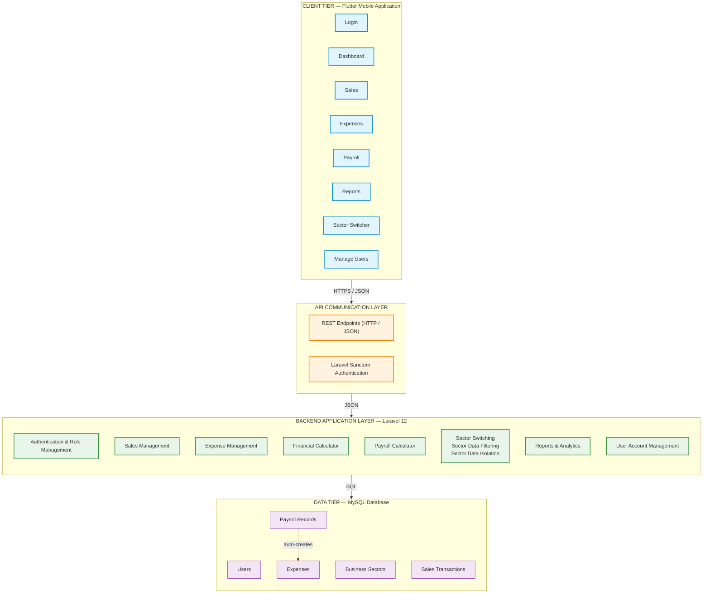

# System Architecture Diagram — DYS Financial Management System (DYS FMS)



## Client Tier — Screens

| Screen | Access |
|--------|--------|
| Login | All roles |
| Dashboard | All roles (role-based data scope) |
| Sales | Business Owner, Event Manager |
| Expenses | Business Owner, Event Manager |
| Payroll | Business Owner (calculates and views payroll for every employee), Event Manager (view own payroll only, cannot calculate), Employee (view own payroll only, cannot calculate) |
| Reports | Business Owner (all sectors, analytics dashboard), Event Manager (assigned sector only), Employee (no separate Reports screen — payroll view only) |
| Business Sector Switcher | Business Owner only |
| Manage Users | Business Owner only (no public or self-registration) |

## Backend Services

| Service | Responsibility |
|---------|---------------|
| Authentication & Role Management | Login credential verification, RBAC enforcement |
| Sales Management | Sales transaction recording and retrieval |
| Expense Management | Expense recording, retrieval, and Payroll-triggered expense creation |
| Financial Calculator | Automated computation of total sales and expenses |
| Payroll Calculator | Salary calculation (Hours Worked × Hourly Rate), permanent storage, auto-creates Expense record |
| Sector Switching / Data Filtering / Isolation | Business Owner sector switching; data scoping per role and sector |
| Reports & Analytics | Dashboard aggregation, cross-sector and per-sector reporting |
| User Account Management | Create/manage Event Manager and Employee accounts; assign role and sector; generate temporary credentials; activate/deactivate accounts |

## Data Tier — Entities

| Entity | Description |
|--------|-------------|
| Users | System actors (Business Owner, Event Manager, Employee/Staff) |
| Business Sectors | DYS Events, B&DYS, Flavors by DYS, SnapDYS Memories |
| Sales Transactions | Individual sales records linked to a User and Sector |
| Expenses | Business expenses — manually recorded or auto-created from Payroll |
| Payroll Records | Computed salary (Hours × Rate), permanently stored, viewable historically |

## Role-Based Access Control (RBAC)

```
Business Owner
    ↓
Full access — all 4 sectors, can switch, record sales/expenses, view analytics,
payroll calculations, and reports across all sectors, and manage user accounts
(create Event Manager/Employee accounts, assign role and sector, generate temporary
credentials, activate/deactivate accounts — no public or self-registration)

Event Manager
    ↓
Assigned sector only — record sales/expenses, view sector reports,
view own payroll only (cannot calculate payroll, cannot view other employees' payroll),
cannot switch sectors

Employee / Event Staff
    ↓
Assigned sector only — view own payroll only (cannot calculate payroll, cannot view other employees' payroll)
cannot record sales/expenses, cannot switch sectors
```

## Key Behaviors

- **Salary → Expense Automation**: When a Payroll Record is created, the system automatically inserts an Expense record with `amount = computed_salary` and a foreign key reference to the originating Payroll Record.
- **Business Sector Switching**: Business Owner only. Switching auto-refreshes Dashboard, Sales, Expenses, and Reports for the selected sector.
- **Default Sector on Login**: Business Owner → DYS Event Management. Event Manager / Employee → their assigned business sector.
- **RBAC Enforcement**: Every request is filtered by role; Event Managers and Employees are permanently scoped to their assigned sector.

## Communication Flow

```
Users → HTTPS Requests → Flutter App → JSON → REST API (Sanctum) → Laravel Backend → SQL → MySQL
```
