# System Flowchart — DYS Financial Management System (DYS FMS)

```mermaid
graph TB
    %% Styles
    classDef startEnd fill:#c8e6c9,stroke:#2e7d32,stroke-width:2px
    classDef process fill:#e3f2fd,stroke:#1565c0,stroke-width:2px
    classDef decision fill:#fff9c4,stroke:#f9a825,stroke-width:2px
    classDef io fill:#e8f5e9,stroke:#388e3c,stroke-width:2px
    classDef auto fill:#f3e5f5,stroke:#7b1fa2,stroke-width:2px,stroke-dasharray:5 5

    %% ========== PROCESS 1: LOGIN & AUTHENTICATION ==========
    subgraph LoginFlow["1. Login & Authentication"]
        L1["Start"]:::startEnd
        L2["Enter Credentials<br/>(Email / Password)"]:::process
        L3["Validate Credentials"]:::decision
        L4{"Credentials Valid?"}:::decision
        L5{"Determine Role"}:::decision
        L6["Business Owner<br/>Default Sector: DYS Event Management"]:::process
        L7["Event Manager<br/>Default Sector: Assigned Sector"]:::process
        L8["Employee / Event Staff<br/>Default Sector: Assigned Sector"]:::process
        L9["Show Error Message"]:::process
        L10["Redirect to Dashboard"]:::process
        L11["End"]:::startEnd

        L1 --> L2 --> L3 --> L4
        L4 -->|"No"| L9 --> L2
        L4 -->|"Yes"| L5
        L5 -->|"Business Owner"| L6 --> L10 --> L11
        L5 -->|"Event Manager"| L7 --> L10 --> L11
        L5 -->|"Employee"| L8 --> L10 --> L11
    end

    %% ========== PROCESS 2: RECORD SALES ==========
    subgraph SalesFlow["2. Record Sales"]
        S1["Start"]:::startEnd
        S2{"Role Check:<br/>Owner or Event Manager?"}:::decision
        S3["Access Denied"]:::process
        S4["Enter Sales Details<br/>(Amount, Description)"]:::process
        S5["Validate Input"]:::decision
        S6{"Valid?"}:::decision
        S7["Save Sales Transaction<br/>(linked to User + Sector)"]:::process
        S8["Display Success"]:::process
        S9["Show Validation Error"]:::process
        S10["End"]:::startEnd

        S1 --> S2
        S2 -->|"Employee"| S3 --> S10
        S2 -->|"Owner / Event Manager"| S4 --> S5 --> S6
        S6 -->|"No"| S9 --> S4
        S6 -->|"Yes"| S7 --> S8 --> S10
    end

    %% ========== PROCESS 3: RECORD EXPENSES ==========
    subgraph ExpenseFlow["3. Record Expenses"]
        E1["Start"]:::startEnd
        E2{"Role Check:<br/>Owner or Event Manager?"}:::decision
        E3["Access Denied"]:::process
        E4["Enter Expense Details<br/>(Amount, Description)"]:::process
        E5["Validate Input"]:::decision
        E6{"Valid?"}:::decision
        E7["Save Expense Record<br/>(linked to User + Sector)"]:::process
        E8["Display Success"]:::process
        E9["Show Validation Error"]:::process
        E10["End"]:::startEnd

        E1 --> E2
        E2 -->|"Employee"| E3 --> E10
        E2 -->|"Owner / Event Manager"| E4 --> E5 --> E6
        E6 -->|"No"| E9 --> E4
        E6 -->|"Yes"| E7 --> E8 --> E10
    end

    %% ========== PROCESS 4: PAYROLL PROCESSING ==========
    subgraph PayrollFlow["4. Payroll Processing"]
        P1["Start"]:::startEnd
        P2{"Role Check:<br/>Business Owner?"}:::decision
        P3["Access Denied<br/>(View own payroll only)"]:::process
        P4["Select Employee"]:::process
        P5["Enter Hours Worked"]:::io
        P6["Validate Payroll Input"]:::decision
        P7{"Hours Valid?"}:::decision
        P8["Show Validation Error"]:::process
        P9["Retrieve Hourly Rate"]:::process
        P10["Calculate Salary<br/>(Hours × Rate)"]:::process
        P11["Store Payroll Record<br/>(stored permanently, viewable historically)"]:::process
        P12["Auto-create Expense Record<br/>(amount = computed_salary,<br/>linked to Payroll Record)"]:::auto
        P13["Display Success"]:::process
        P14["End"]:::startEnd

        P1 --> P2
        P2 -->|"Event Manager / Employee"| P3 --> P14
        P2 -->|"Business Owner"| P4 --> P5 --> P6 --> P7
        P7 -->|"No"| P8 --> P5
        P7 -->|"Yes"| P9 --> P10 --> P11 --> P12 --> P13 --> P14
    end

    %% ========== PROCESS 7: USER ACCOUNT MANAGEMENT ==========
    subgraph UserMgmtFlow["7. User Account Management"]
        UM1["Start"]:::startEnd
        UM2{"Role Check:<br/>Business Owner?"}:::decision
        UM3["Access Denied"]:::process
        UM4["Open Manage Users"]:::process
        UM5["Create User"]:::io
        UM6["Assign Role"]:::io
        UM7["Assign Business Sector"]:::io
        UM8["Generate Temporary Password"]:::process
        UM9["Save Account"]:::process
        UM10["Display Credentials"]:::process
        UM11["End"]:::startEnd

        UM1 --> UM2
        UM2 -->|"Event Manager / Employee"| UM3 --> UM11
        UM2 -->|"Business Owner"| UM4 --> UM5 --> UM6 --> UM7 --> UM8 --> UM9 --> UM10 --> UM11
    end

    %% ========== PROCESS 5: BUSINESS SECTOR SWITCHING ==========
    subgraph SwitchFlow["5. Business Sector Switching"]
        SW1["Start"]:::startEnd
        SW2{"Role Check:<br/>Business Owner?"}:::decision
        SW3["Access Denied"]:::process
        SW4["Select Target Sector"]:::process
        SW5["Load Selected Sector Data"]:::process
        SW6["Refresh Dashboard<br/>(sector-specific data)"]:::process
        SW7["Refresh Sales<br/>(sector-specific transactions)"]:::process
        SW8["Refresh Expenses<br/>(sector-specific expenses)"]:::process
        SW9["Refresh Reports<br/>(sector-specific reports)"]:::process
        SW10["Return to Dashboard"]:::process
        SW11["End"]:::startEnd

        SW1 --> SW2
        SW2 -->|"Event Manager / Employee"| SW3 --> SW11
        SW2 -->|"Business Owner"| SW4 --> SW5 --> SW6 --> SW7 --> SW8 --> SW9 --> SW10 --> SW11
    end

    %% ========== PROCESS 6: GENERATE REPORTS ==========
    subgraph ReportFlow["6. Generate Reports"]
        R1["Start"]:::startEnd
        R2{"Determine Role"}:::decision
        R3["Business Owner:<br/>All Sectors, Analytics Dashboard,<br/>Cross-sector Reports"]:::process
        R4["Event Manager:<br/>Assigned Sector Reports Only"]:::process
        R5["Employee / Event Staff:<br/>Authorized Records Only<br/>(own payroll)"]:::process
        R6["Generate Report"]:::process
        R7["Display Report"]:::process
        R8["End"]:::startEnd

        R1 --> R2
        R2 -->|"Business Owner"| R3 --> R6 --> R7 --> R8
        R2 -->|"Event Manager"| R4 --> R6 --> R7 --> R8
        R2 -->|"Employee"| R5 --> R6 --> R7 --> R8
    end
```

## Process Summary

| # | Process | Actors | Key Decisions |
|---|---------|--------|--------------|
| 1 | Login & Authentication | All roles | Credential validation, Role determination, Default sector assignment |
| 2 | Record Sales | Business Owner, Event Manager | Role check (Employee denied), Input validation |
| 3 | Record Expenses | Business Owner, Event Manager | Role check (Employee denied), Input validation |
| 4 | Payroll Processing | Business Owner | Role check (Event Manager/Employee denied — view own payroll only), Employee selection, Input validation |
| 5 | Business Sector Switching | Business Owner only | Role check (EM/Employee denied), Cascade refresh (Dashboard, Sales, Expenses, Reports) |
| 6 | Generate Reports | All roles | Role-based report type availability |
| 7 | User Account Management | Business Owner only | Role check (Event Manager/Employee denied), account creation, role/sector assignment |

## Business Rules Enforced

| Rule | Flow Applied |
|------|-------------|
| Owner defaults to DYS Event Management | Flow 1 |
| EM/Employee defaults to assigned sector | Flow 1 |
| Only Owner can switch sectors | Flow 5 |
| Switching refreshes Dashboard, Sales, Expenses, Reports | Flow 5 |
| Owner/EM can record sales and expenses | Flows 2, 3 |
| Employee cannot record sales or expenses | Flows 2, 3 |
| Only Owner can calculate (process) payroll | Flow 4 |
| Event Manager/Employee cannot calculate payroll, may view own payroll only | Flow 4 |
| Payroll = Hours × Rate, stored permanently | Flow 4 |
| Payroll auto-creates Expense record | Flow 4 |
| Reports scoped by role | Flow 6 |
| Only Business Owner can create, assign roles/sectors for, and activate/deactivate user accounts | Flow 7 |
| No public registration or self-registration exists | Flow 7 |

## Decision Points Summary

- **Flow 1**: Credential validation (Valid / Invalid), Role (Owner / EM / Employee)
- **Flow 2**: Role check (Owner/EM vs Employee), Input validation (Valid / Invalid)
- **Flow 3**: Role check (Owner/EM vs Employee), Input validation (Valid / Invalid)
- **Flow 4**: Role check (Owner vs Event Manager/Employee), Input validation (Valid / Invalid)
- **Flow 5**: Role check (Owner vs EM/Employee)
- **Flow 6**: Role (Owner / EM / Employee)
- **Flow 7**: Role check (Owner vs Event Manager/Employee)
