# User Flow Diagram — DYS Financial Management System (DYS FMS)

```mermaid
graph TB
    %% Styles
    classDef startEnd fill:#c8e6c9,stroke:#2e7d32,stroke-width:2px
    classDef screen fill:#e3f2fd,stroke:#1565c0,stroke-width:2px
    classDef action fill:#fff9c4,stroke:#f9a825,stroke-width:2px
    classDef decision fill:#fff9c4,stroke:#f9a825,stroke-width:2px
    classDef restricted fill:#ffebee,stroke:#c62828,stroke-width:2px,stroke-dasharray:5 5
    classDef logout fill:#fce4ec,stroke:#c62828,stroke-width:2px

    %% ========== BUSINESS OWNER FLOW ==========
    subgraph OwnerFlow["Business Owner"]
        O1["Start"]:::startEnd
        O2["Login Screen"]:::screen
        O3["Enter Credentials"]:::action
        O4["Dashboard<br/>(Default: DYS Event Management)"]:::screen
        O5["Record Sales"]:::screen
        O6["Record Expenses"]:::screen
        O7["Calculate/View Payroll<br/>(All employees)"]:::screen
        O8["View Reports<br/>(All sectors, Analytics, Cross-sector)"]:::screen
        O9["Business Sector Switcher"]:::screen
        O10["Select Target Sector"]:::action
        O11["Auto-refresh:<br/>Dashboard • Sales • Expenses • Reports"]:::action
        O12["Return to Dashboard"]:::action
        O13["Logout"]:::logout
        O14["End"]:::startEnd
        O15["Manage Users"]:::screen
        O16["Create User"]:::action
        O17["Assign Role"]:::action
        O18["Assign Business Sector"]:::action
        O19["Generate Temporary Password"]:::action
        O20["Save Account & Display Credentials"]:::action

        O1 --> O2 --> O3 --> O4
        O4 --> O5
        O4 --> O6
        O4 --> O7
        O4 --> O8
        O4 --> O9
        O4 --> O15
        O5 --> O4
        O6 --> O4
        O7 --> O4
        O8 --> O4
        O9 --> O10 --> O11 --> O12 --> O4
        O15 --> O16 --> O17 --> O18 --> O19 --> O20 --> O4
        O4 --> O13 --> O14
    end

    %% ========== EVENT MANAGER FLOW ==========
    subgraph ManagerFlow["Event Manager"]
        M1["Start"]:::startEnd
        M2["Login Screen"]:::screen
        M3["Enter Credentials"]:::action
        M4["Dashboard<br/>(Default: Assigned Sector)"]:::screen
        M5["Record Sales<br/>(Sector-scoped)"]:::screen
        M6["Record Expenses<br/>(Sector-scoped)"]:::screen
        M7["View Own Payroll<br/>(Own record only)"]:::screen
        M8["View Reports<br/>(Assigned sector only)"]:::screen
        M9["Business Sector Switcher<br/>(NOT AVAILABLE)"]:::restricted
        M10["Logout"]:::logout
        M11["End"]:::startEnd

        M1 --> M2 --> M3 --> M4
        M4 --> M5
        M4 --> M6
        M4 --> M7
        M4 --> M8
        M4 --> M9
        M9 -.->|"Permanently assigned — cannot switch"| M4
        M4 --> M10 --> M11
        M5 --> M4
        M6 --> M4
        M7 --> M4
        M8 --> M4
    end

    %% ========== EMPLOYEE FLOW ==========
    subgraph EmployeeFlow["Employee / Event Staff"]
        E1["Start"]:::startEnd
        E2["Login Screen"]:::screen
        E3["Enter Credentials"]:::action
        E4["Dashboard<br/>(Default: Assigned Sector)"]:::screen
        E5["Record Sales<br/>(NOT AVAILABLE)"]:::restricted
        E6["Record Expenses<br/>(NOT AVAILABLE)"]:::restricted
        E7["View Own Payroll<br/>(Own records only)"]:::screen
        E9["Business Sector Switcher<br/>(NOT AVAILABLE)"]:::restricted
        E10["Logout"]:::logout
        E11["End"]:::startEnd

        E1 --> E2 --> E3 --> E4
        E4 --> E5
        E4 --> E6
        E4 --> E7
        E4 --> E9
        E5 -.->|"Access denied — view-only role"| E4
        E6 -.->|"Access denied — view-only role"| E4
        E9 -.->|"Permanently assigned — cannot switch"| E4
        E4 --> E10 --> E11
        E7 --> E4
    end
```



## Flow Summary

### Business Owner Flow

```text
Login → Dashboard (DYS Event Management)
         ├── Record Sales
         ├── Record Expenses
         ├── View Payroll (all calculations)
         ├── View Reports (all sectors, analytics, cross-sector)
         ├── Manage Users (create account, assign role, assign sector, generate temporary password) — Owner only
         └── Switch Sector → Select Target → Auto-refresh Dashboard/Sales/Expenses/Reports → Dashboard
         └── Logout
```

### Event Manager Flow

```text
Login → Dashboard (assigned sector)
         ├── Record Sales (sector-scoped)
         ├── Record Expenses (sector-scoped)
         ├── View Own Payroll (own record only, cannot calculate)
         ├── View Reports (assigned sector only)
         └── [Sector Switcher: NOT AVAILABLE — permanently assigned]
         └── Logout
```

### Employee / Event Staff Flow

```text
Login → Dashboard (assigned sector)
         ├── [Record Sales: NOT AVAILABLE — view-only role]
         ├── [Record Expenses: NOT AVAILABLE — view-only role]
         ├── View Own Payroll (own records only, cannot calculate)
         └── [Sector Switcher: NOT AVAILABLE — permanently assigned]
         └── Logout
```

## Screen Navigation Matrix

| Screen | Business Owner | Event Manager | Employee |
|--------|---------------|---------------|----------|
| Login | ✓ | ✓ | ✓ |
| Dashboard | ✓ (DYS Event Mgmt) | ✓ (assigned sector) | ✓ (assigned sector) |
| Sales | ✓ | ✓ (sector-scoped) | ✗ |
| Expenses | ✓ | ✓ (sector-scoped) | ✗ |
| Payroll | ✓ (all employees; only role that can calculate) | ✓ (own only) | ✓ (own only) |
| Reports | ✓ (all sectors, analytics) | ✓ (assigned sector only) | ✗ (no separate Reports screen) |
| Sector Switcher | ✓ | ✗ | ✗ |
| Manage Users | ✓ (only role with access) | ✗ | ✗ |
| Logout | ✓ | ✓ | ✓ |

## Business Rules Enforced

| Rule | Applied |
|------|---------|
| Owner defaults to DYS Event Management on login | Owner flow |
| EM/Employee defaults to assigned sector on login | EM + Employee flows |
| Only Owner can switch sectors | Owner flow only |
| EM/Employee cannot switch sectors | Denied paths |
| Owner/EM can record sales and expenses | Owner + EM flows |
| Employee cannot record sales or expenses | Denied paths |
| Only Business Owner can calculate payroll | Payroll flow |
| Event Manager / Employee may only view their own payroll | Per-role Payroll views |
| Reports scoped by role and sector; Employees have no separate Reports screen | Per-role Report views |
| Only Business Owner can create, assign roles/sectors for, and activate/deactivate user accounts | Manage Users flow |
| No public registration or self-registration exists | Manage Users flow |
