# Wireframes — DYS Financial Management System (DYS FMS)

## 1. Login Screen

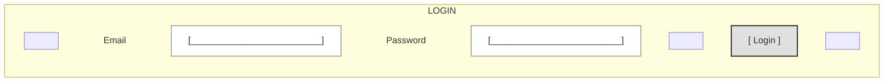

## 2. Dashboard

### Business Owner

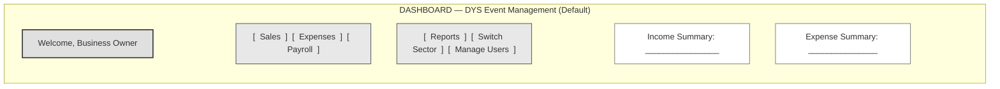

### Event Manager

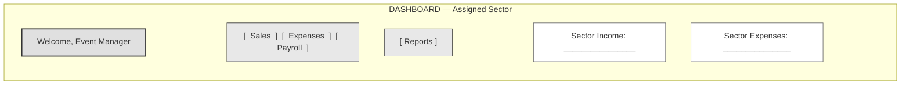

### Employee

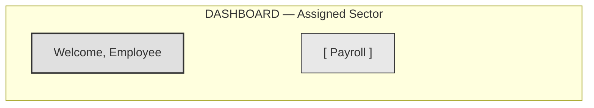

## 3. Sales

### Business Owner / Event Manager

```mermaid
graph TB
    subgraph Sales["SALES"]
        direction TB
        SA1["Record Sale"]
        SA2[" "]
        SA3["Amount:        [________________]"]
        SA4["Description:   [________________]"]
        SA5[" "]
        SA6["[     Save Sale Record     ]"]
        SA7[" "]
        SA8["Recent Transactions"]
        SA9["____________________________"]
        SA10["____________________________"]
        SA11[" "]
    end

    classDef title fill:#e0e0e0,stroke:#333,stroke-width:2px
    classDef field fill:#fff,stroke:#666,stroke-width:1px
    classDef btn fill:#e8e8e8,stroke:#333,stroke-width:2px
    classDef list fill:#fff,stroke:#666,stroke-width:1px
    classDef spacer fill:transparent,stroke:none

    class SA1 title
    class SA3,SA4 field
    class SA6 btn
    class SA8 title
    class SA9,SA10 list
    class SA2,SA5,SA7,SA11 spacer
```

### Employee

Not available.

## 4. Expenses

### Business Owner / Event Manager

```mermaid
graph TB
    subgraph Expenses["EXPENSES"]
        direction TB
        EX1["Record Expense"]
        EX2[" "]
        EX3["Amount:        [________________]"]
        EX4["Description:   [________________]"]
        EX5[" "]
        EX6["[    Save Expense Record    ]"]
        EX7[" "]
        EX8["Recent Expenses"]
        EX9["____________________________"]
        EX10["____________________________"]
        EX11[" "]
    end

    classDef title fill:#e0e0e0,stroke:#333,stroke-width:2px
    classDef field fill:#fff,stroke:#666,stroke-width:1px
    classDef btn fill:#e8e8e8,stroke:#333,stroke-width:2px
    classDef list fill:#fff,stroke:#666,stroke-width:1px
    classDef spacer fill:transparent,stroke:none

    class EX1 title
    class EX3,EX4 field
    class EX6 btn
    class EX8 title
    class EX9,EX10 list
    class EX2,EX5,EX7,EX11 spacer
```

### Employee

Not available.

## 5. Payroll

### Business Owner

```mermaid
graph TB
    subgraph Payroll["PAYROLL"]
        direction TB
        PY1["Payroll Calculation"]
        PY2[" "]
        PY3["Select Employee:  [________________]"]
        PY4["Hours Worked:     [________________]"]
        PY5["Hourly Rate:      [________________]"]
        PY6["Computed Salary:  [________________]"]
        PY7[" "]
        PY8["[     Calculate & Save     ]"]
        PY9[" "]
        PY10["Payroll History"]
        PY11["____________________________"]
        PY12["____________________________"]
        PY13[" "]
    end

    classDef title fill:#e0e0e0,stroke:#333,stroke-width:2px
    classDef field fill:#fff,stroke:#666,stroke-width:1px
    classDef btn fill:#e8e8e8,stroke:#333,stroke-width:2px
    classDef list fill:#fff,stroke:#666,stroke-width:1px
    classDef spacer fill:transparent,stroke:none

    class PY1 title
    class PY3,PY4,PY5,PY6 field
    class PY8 btn
    class PY10 title
    class PY11,PY12 list
    class PY2,PY7,PY9,PY13 spacer
```

### Event Manager

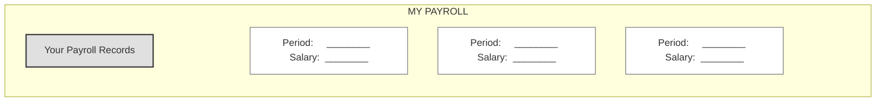

Event Manager cannot calculate payroll — view-only, own record only, same as Employee.

### Employee


## 6. Reports

### Business Owner

```mermaid
graph TB
    subgraph OwnerReports["REPORTS"]
        direction TB
        OR1["Reports Overview"]
        OR2[" "]
        OR3["[  Analytics Dashboard  ]"]
        OR4["[  Cross-sector Reports  ]"]
        OR5["[  Sector Reports  ]"]
        OR6[" "]
        OR7["+----------------------------+"]
        OR8["|   Chart / Graph Area        |"]
        OR9["|                             |"]
        OR10["|                             |"]
        OR11["+----------------------------+"]
        OR12[" "]
    end

    classDef title fill:#e0e0e0,stroke:#333,stroke-width:2px
    classDef reportBtn fill:#e8e8e8,stroke:#333,stroke-width:1px
    classDef chart fill:#fff,stroke:#666,stroke-width:1px
    classDef spacer fill:transparent,stroke:none

    class OR1 title
    class OR3,OR4,OR5 reportBtn
    class OR7,OR8,OR9,OR10,OR11 chart
    class OR2,OR6,OR12 spacer
```

### Event Manager

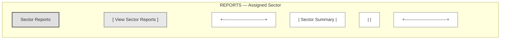

### Employee

Not available. Employees do not have a separate Reports screen; they view their own payroll from the Payroll screen only.

## 7. Business Sector Switcher

### Business Owner Only

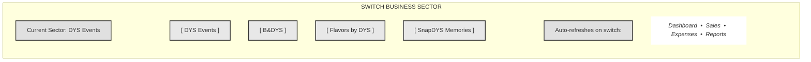

### Event Manager / Employee

Not available.

## 8. Manage Users

### Business Owner Only

```mermaid
graph TB
    subgraph ManageUsers["MANAGE USERS"]
        direction TB
        MU1["User List"]
        MU2[" "]
        MU3["Name           Role          Sector        Status"]
        MU4["____________________________________________"]
        MU5["____________________________________________"]
        MU6[" "]
        MU7["[     Add User     ]"]
        MU8[" "]
        MU9["Add / Edit User"]
        MU10["Name:      [________________]"]
        MU11["Email:     [________________]"]
        MU12["Role:      [________________]"]
        MU13["Sector:    [________________]"]
        MU14[" "]
        MU15["[  Generate Temporary Password  ]  [  Save  ]  [  Activate/Deactivate  ]"]
        MU16[" "]
    end

    classDef title fill:#e0e0e0,stroke:#333,stroke-width:2px
    classDef list fill:#fff,stroke:#666,stroke-width:1px
    classDef btn fill:#e8e8e8,stroke:#333,stroke-width:2px
    classDef field fill:#fff,stroke:#666,stroke-width:1px
    classDef spacer fill:transparent,stroke:none

    class MU1,MU9 title
    class MU3,MU4,MU5 list
    class MU7,MU15 btn
    class MU10,MU11,MU12,MU13 field
    class MU2,MU6,MU8,MU14,MU16 spacer
```

No public registration, self-registration, Register/Sign Up screen, or invitation links exist. Only the Business Owner can create, edit, activate, or deactivate accounts.

### Event Manager / Employee

Not available.

---

## Screen Descriptions

| # | Screen | Purpose |
|---|--------|---------|
| 1 | Login | Credential entry (Email, Password, Login button) |
| 2 | Dashboard | Role-based landing page with navigation to permitted screens |
| 3 | Sales | Record and view sales transactions (Owner/EM only; EM sector-scoped) |
| 4 | Expenses | Record and view expenses (Owner/EM only; EM sector-scoped) |
| 5 | Payroll | Business Owner calculates and stores payroll for any employee; Event Manager and Employee view only their own payroll and cannot calculate |
| 6 | Reports | Role-based reporting (Owner: all; EM: sector). Employees have no separate Reports screen — their own-payroll view is their only reporting access. |
| 7 | Business Sector Switcher | Switch between the 4 sectors (Owner only; auto-refresh) |
| 8 | Manage Users | Business Owner creates, edits, and activates/deactivates Event Manager and Employee accounts; assigns role and sector; generates temporary passwords. No public or self-registration. |

## Navigation Mapping

```text
Login ──► Dashboard ──► Sales
                    ├──► Expenses
                    ├──► Payroll
                    ├──► Reports
                    └──► Sector Switcher (Owner only)
                    └──► Manage Users (Owner only)
                    └──► Logout
```

## Role Access Matrix

| Screen | Business Owner | Event Manager | Employee |
|--------|---------------|---------------|----------|
| Login | ✓ | ✓ | ✓ |
| Dashboard | ✓ (DYS Event Mgmt) | ✓ (assigned sector) | ✓ (assigned sector) |
| Sales | ✓ | ✓ (sector-scoped) | ✗ |
| Expenses | ✓ | ✓ (sector-scoped) | ✗ |
| Payroll | ✓ (all employees; only role that can calculate) | ✓ (own only) | ✓ (own only) |
| Reports | ✓ (all, analytics, cross-sector) | ✓ (sector only) | ✗ (no separate Reports screen) |
| Sector Switcher | ✓ | ✗ | ✗ |
| Manage Users | ✓ (only role with access) | ✗ | ✗ |
| Logout | ✓ | ✓ | ✓ |

## Business Rules Enforced

| Rule | Applied |
|------|---------|
| Login requires only Email + Password — no registration, no forgot password | Login screen |
| Owner default dashboard: DYS Event Management | Owner Dashboard |
| EM/Employee default dashboard: assigned sector | EM + Employee Dashboards |
| Owner/EM can record sales | Sales screen |
| Employee cannot record sales | No Employee Sales screen |
| Owner/EM can record expenses | Expenses screen |
| Employee cannot record expenses | No Employee Expenses screen |
| Payroll for Owner: all employees, full calculation | Payroll screen (Owner) |
| Payroll for EM: view-only, own record only, cannot calculate | My Payroll screen (EM) |
| Payroll for Employee: view-only, own record only, cannot calculate | My Payroll screen (Employee) |
| Owner: all reports, analytics, cross-sector | Reports screen (Owner) |
| EM: sector reports only | Reports screen (EM) |
| Employee: no separate Reports screen — own-payroll view is their only reporting access | N/A |
| Sector Switcher: Owner only, 4 sector buttons, auto-refresh | Sector Switcher screen |
| No confirmation dialog on sector switch | Sector Switcher screen |
| Manage Users: Owner only — create, edit, activate/deactivate accounts, assign role/sector, generate temporary password | Manage Users screen |
| No public registration, self-registration, Register/Sign Up screen, or invitation links | Manage Users screen |
