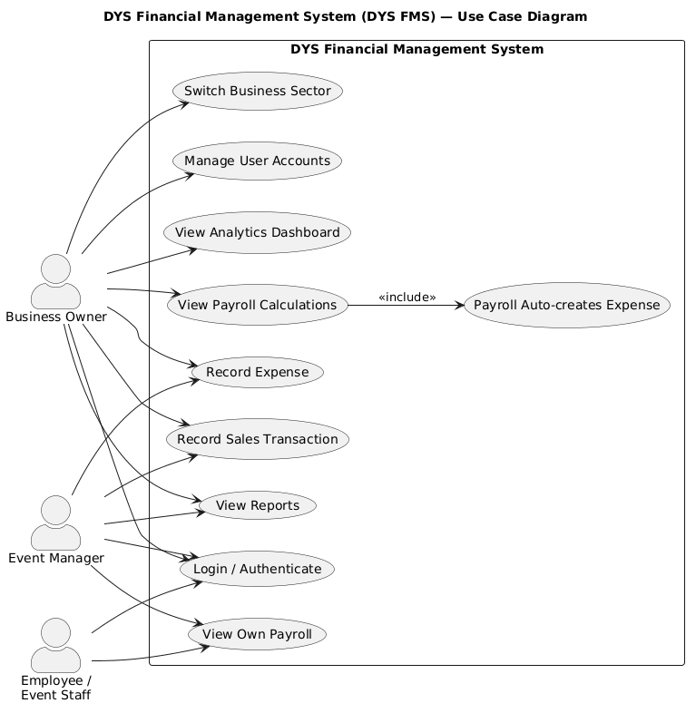
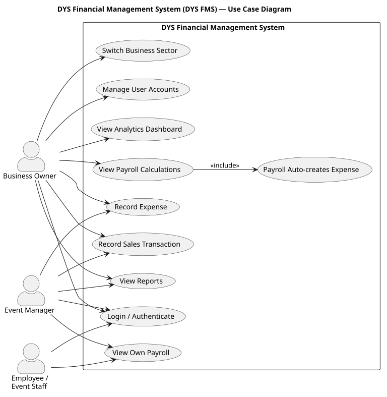
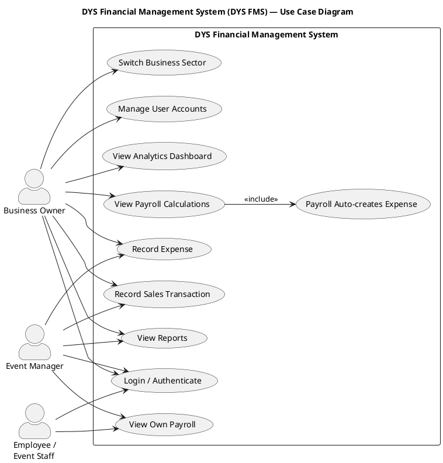

# Use Case Diagram — DYS Financial Management System (DYS FMS)

**Document:** Use Case Diagram (Visual)
**Version:** 2.0
**Status:** Draft
**Notation:** UML 2.x Use Case Diagram (PlantUML)

## Overview

This document presents the UML Use Case Diagram for the DYS Financial Management System. The diagram depicts three actor roles, ten use cases, and their relationships using strict UML notation. It conforms to the approved Concept Paper, Functional Requirements Specification (FRS), Client Clarifications, and all other approved blueprint documents.

## Rendered Diagram

*Figure 1: DYS FMS Use Case Diagram (PNG)*

*Figure 2: DYS FMS Use Case Diagram (SVG — vector format suitable for academic submission)*

## PlantUML Source

The diagram is defined in `memory/diagrams/use-case-diagram.puml` and rendered using PlantUML (UML 2.x notation).

## UML Notation Guide

| Element | UML Notation | Representation |
|---------|-------------|----------------|
| **Actor** | Stick figure (`actor` keyword) | Business Owner, Event Manager, Employee / Event Staff |
| **Use Case** | Ellipse (`usecase` keyword) | Functional goals placed inside system boundary |
| **System Boundary** | Rectangle (`rectangle` keyword) | "DYS Financial Management System" encloses all use cases |
| **Association** | Solid line (`-->`) | Connects an actor to a use case they participate in |
| **Include** | Dashed arrow with `<<include>>` stereotype | UC5 (View Payroll Calculations) → UC9 (Payroll Auto-creates Expense); mandatory sub-process |

### Notation Rules Applied

1. **Actors are outside the system boundary** — All three actor boxes are drawn outside the DYS FMS rectangle, per UML convention.
2. **Use cases are inside the system boundary** — All ten use case ovals are placed within the system rectangle.
3. **Solid association lines** — Each actor-to-use-case relationship is a solid line (no arrows in UML 2 for basic association; PlantUML renders a directed line for clarity but the semantics are undirected association).
4. **`<<include>>`** — Used only for mandatory sub-processes (UC5 always triggers UC9). The arrow direction is from the base use case to the included use case.
5. **`<<extend>>`** — Not used in this diagram, as no optional extension points have been defined.
6. **Generalization (`◁—`)** — Not used in this diagram, as the three actor roles are distinct with no inheritance hierarchy in the system.

## Actors

| Actor | Description |
|-------|-------------|
| **Business Owner** | Full system access. Default sector on login: DYS Event Management. Can switch sectors. Can view data across all four business sectors. Only role that can calculate payroll and manage user accounts. |
| **Event Manager** | Sector-specific operational access. Default sector on login: assigned business sector. Permanently assigned to one sector; cannot switch. Can record transactions and view reports within assigned sector. Can view own payroll only. |
| **Employee / Event Staff** | Limited view-only access. Default sector on login: assigned business sector. Permanently assigned to one sector; cannot switch. Can view own payroll only. |

## Use Case Descriptions

| ID | Use Case | Description | Primary Actors |
|----|----------|-------------|----------------|
| UC1 | Login / Authenticate | Authenticate user credentials via Sanctum token-based authentication. Prerequisite for all other use cases. | All actors |
| UC2 | Record Sales Transaction | Create a new sales transaction record including items, quantities, and amounts. | Business Owner, Event Manager |
| UC3 | Record Expense | Create a new expense record. | Business Owner, Event Manager |
| UC4 | View Analytics Dashboard | View interactive visual analytics dashboard with charts and graphs for performance monitoring. | Business Owner |
| UC5 | View Payroll Calculations | Calculate and view payroll for any employee (Hours Worked × Hourly Rate). Automatically triggers an Expense record creation (see UC9). | Business Owner |
| UC6 | View Reports | View financial reports (income, expenses, summaries, sector financial performance). Business Owner sees cross-sector and analytics reports; Event Manager sees assigned sector only. | Business Owner, Event Manager |
| UC7 | View Own Payroll | View own payroll history. Cannot calculate or view other employees' payroll. | Event Manager, Employee / Event Staff |
| UC8 | Switch Business Sector | Toggle between business sectors (DYS Events, B&DYS, Flavors by DYS, SnapDYS Memories). Auto-refreshes Dashboard, Sales, Expenses, and Reports on switch. | Business Owner |
| UC9 | Payroll Auto-creates Expense | System-triggered action: when UC5 is performed, the system automatically creates an Expense record for the computed payroll amount. | System (triggered by UC5) |
| UC10 | Manage User Accounts | Create user accounts, assign roles and business sectors, generate temporary passwords, activate/deactivate accounts. No public registration or self-registration exists. | Business Owner |

## Actor Permissions Mapping

| Use Case | Business Owner | Event Manager | Employee / Event Staff |
|----------|:--------------:|:-------------:|:----------------------:|
| UC1 — Login / Authenticate | ✓ | ✓ | ✓ |
| UC2 — Record Sales Transaction | ✓ | ✓ | — |
| UC3 — Record Expense | ✓ | ✓ | — |
| UC4 — View Analytics Dashboard | ✓ | — | — |
| UC5 — View Payroll Calculations | ✓ (all employees; only role that can calculate) | — | — |
| UC6 — View Reports | ✓ (all sectors, analytics, cross-sector) | ✓ (assigned sector only) | — |
| UC7 — View Own Payroll | — | ✓ (own only; cannot calculate) | ✓ (own only; cannot calculate) |
| UC8 — Switch Business Sector | ✓ (only role) | — | — |
| UC9 — Payroll Auto-creates Expense | System action (triggered by UC5) | | |
| UC10 — Manage User Accounts | ✓ (only role; no public/self-registration) | — | — |

## Consistency Audit

Each element of this diagram has been verified against all approved blueprint documents.

| Source | Status | Notes |
|--------|--------|-------|
| Concept Paper | ✓ | All 10 use cases traceable to features in Concept Paper |
| Client Clarifications | ✓ | Role permissions and access levels confirmed |
| System Architecture | ✓ | Actor structure matches architecture roles |
| System Flowchart | ✓ | Use case flow matches flowchart decision points |
| User Flow Diagram | ✓ | Screen/feature access per role aligned |
| Wireframes (Low + Hi-Fi) | ✓ | UI screens map to each use case |
| ER Diagram | ✓ | Entities and relationships support all use cases |
| Database Schema | ✓ | Schema supports all transactional and reporting use cases |
| Data Dictionary | ✓ | Fields and types cover use case data requirements |
| Physical ERD | ✓ | Implementation entities mapped |
| System Components | ✓ | Component responsibilities align with use case boundaries |
| Project Memory | ✓ | All approved features present; no unapproved features added |
| FRS (FR-001 to FR-008) | ✓ | FR-001 (Auth) → UC1; FR-002 (Sales) → UC2; FR-003 (Expenses) → UC3; FR-004 (Payroll) → UC5, UC7, UC9; FR-005 (Sector Switch) → UC8; FR-006 (User Mgmt) → UC10; FR-007 (Reporting) → UC4, UC6; FR-008 (Audit) — cross-cutting |
| API Specification | ✓ | Endpoints support all use case operations |
| Navigation Map | ✓ | Screen transitions match actor use case workflows |
| UI Style Guide | ✓ | Component inventory supports all use case screens |
| Validation Rules Matrix | ✓ | 54 validation rules cover all use case input scenarios |
| Requirements Traceability Matrix | ✓ | All 8 FRs mapped to use cases |
| Development Roadmap | ✓ | Phasing aligns with use case dependencies |
| Use Case Spec (use-case.md) | ⚠️ | See Conflict Report below |

### Traceability Summary

| FRS ID | Requirement | Use Case Mapping |
|--------|-------------|-----------------|
| FR-001 | Authentication | UC1 |
| FR-002 | Dashboard | UC4 |
| FR-003 | User Account Management | UC10 |
| FR-004 | Record Sales | UC2 |
| FR-005 | Record Expenses | UC3 |
| FR-006 | Payroll | UC5, UC7, UC9 |
| FR-007 | Reports | UC6 |
| FR-008 | Business Sector Switching | UC8 |

## Conflict Report

### Issue 1: Use Case Spec — UC6 Actor Mapping

**Source:** `memory/blueprint/use-case.md` line 20

> "6. **View Reports** — Event Manager"

**Conflicting Sources:**
- **Concept Paper** (lines 20, 48, 79, 83): Business Owner has "full access, cross-sector visibility" and "monitor business performance visually across different business sectors", implying access to reports.
- **FRS FR-007**: "Business Owner: all sectors, analytics dashboard, cross-sector reports. Event Manager: assigned sector reports only."
- **Validation Rules Matrix** (line 103, APPROVED — FROZEN): "Business Owner: all sectors, analytics, cross-sector. Event Manager: assigned sector only."
- **Existing approved Mermaid diagram**: Shows Business Owner associated with UC6.
- **User Flow Diagram**: "Generate Reports — All roles (role-specific views)."

**Verdict:** The use case spec text at `use-case.md:20` is inconsistent with the Concept Paper, FRS, Validation Rules Matrix, and all other diagram/flow documents. The diagram correctly shows both Business Owner and Event Manager associated with UC6 (View Reports).

**Resolution:** Use case spec (`use-case.md`) should be updated to read: "6. **View Reports** — Business Owner, Event Manager". The UML diagram uses the correct mapping (BO + EM → UC6).

### Issue 2: Use Case Name Consistency

**Source:** `use-case.md` line 17 uses "Record Expense" (singular)

**Consistency Check:** All other documents use "Record Expense" or "Record Expenses". The diagram uses "Record Expense" (matching the use case spec). This is a minor convention difference — singular vs. plural — and does not affect correctness.

## Version History

| Version | Date | Author | Change |
|---------|------|--------|--------|
| 1.0 | — | — | Initial Mermaid diagram |
| 2.0 | 2026-07-29 | — | Rebuilt using strict UML 2.x notation (PlantUML); added rendered PNG/SVG; expanded documentation; ran full consistency audit; documented conflicts |

## Related Documents

- `memory/diagrams/use-case-diagram.puml` — PlantUML source file
- `memory/diagrams/use-case-diagram.png` — Rendered PNG image
- `memory/diagrams/use-case-diagram.svg` — Rendered SVG image
- `memory/blueprint/use-case.md` — Use case textual specification
- `memory/concept-paper.md` — Primary source of truth
- `memory/blueprint/functional-requirements-specification.md` — FRS
- `memory/project-memory.md` — Project memory
